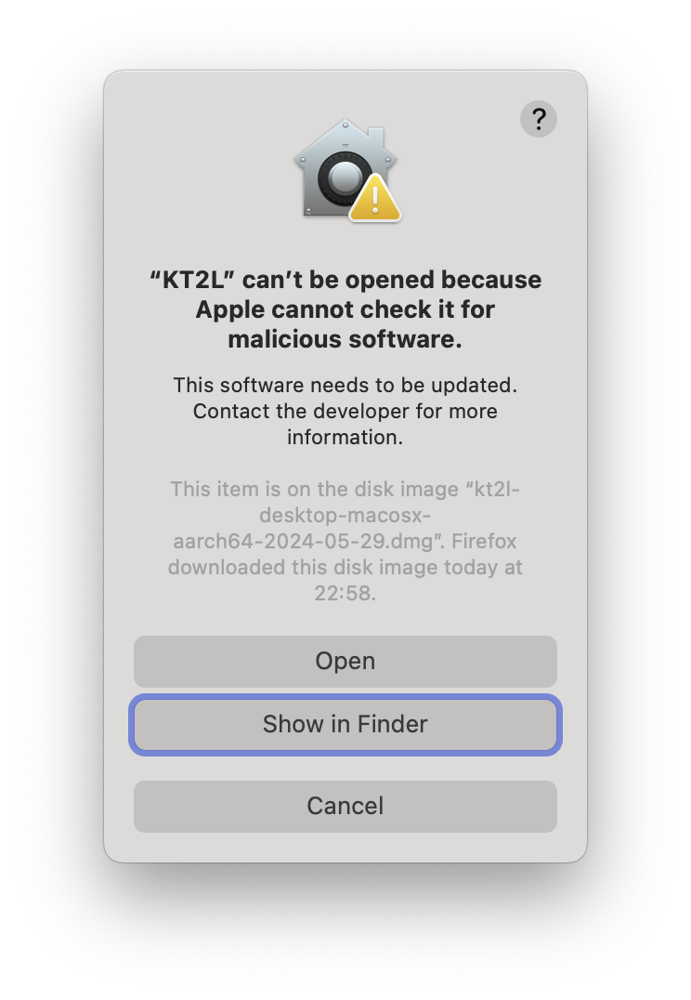

# Desktop

The desktop is a bundled server version with a browser frontend and a java SDK.
They are all together bundled to a desktop application for the target OS.

## Mac OSX Bundle

The bundle is a dmg image file which contains the application. If you install
the application in /Applications you can run it like each other application.

It will use autologin and create a `.kt2l` directory in user home by default.

The first time you start the application MacOS will warn you that the application
is from an unknown developer and it's not possible to open it. You can open it
using the `command` key and the `right mouse button` and select open. The you
will see the same warning but you have the option to open it anyway.



Click `Open` to start the application. The next time you start the application you
can start it like each other application.

If you start the MacOS Application maybe the PATH is not set correctly and clusters
like GKE and EKS are not accessible. You can configure the PATH in the settings dialog.
You need to restart the application to apply the changes.

## Windows Bundle

The bundle is a exe file which contains the application. If you download it
you can use it as native windows application.

It will use autologin and create a `.kt2l` directory in user home by default.

## Linux DEB

Linux distributions supporting deb packages can use the deb package to install the desktop.
To install the latest snapshot version of the desktop download the DEB file from the website and
install it using 

```bash
sudo apt install ./Download/kt2l-desktop-linux-amd64_...deb
```
Now the application can be startet with
```bash
/opt/kt2l-desktop/bin/kt2l-desktop &
```
Before you update remove the package with
```bash
sudo apt remove kt2l-desktop
```

WIP: To use a desktop icon install (once) a desktop file:

```bash
echo "[Desktop Entry]
Name=KT2L
Comment=KT2L Desktop
Terminal=false
Exec=/opt/kt2l-deskop/bin/kt2l-desktop
Icon=/opt/kt2l-desktop/lib/kt2l-desktop.png
Categories=Utility;Security;
Type=Application
" > kt2l-desktop.desktop

desktop-file-install ./kt2l-desktop.desktop --dir=~/.local/share/applications
update-desktop-database ~/.local/share/applications
```

