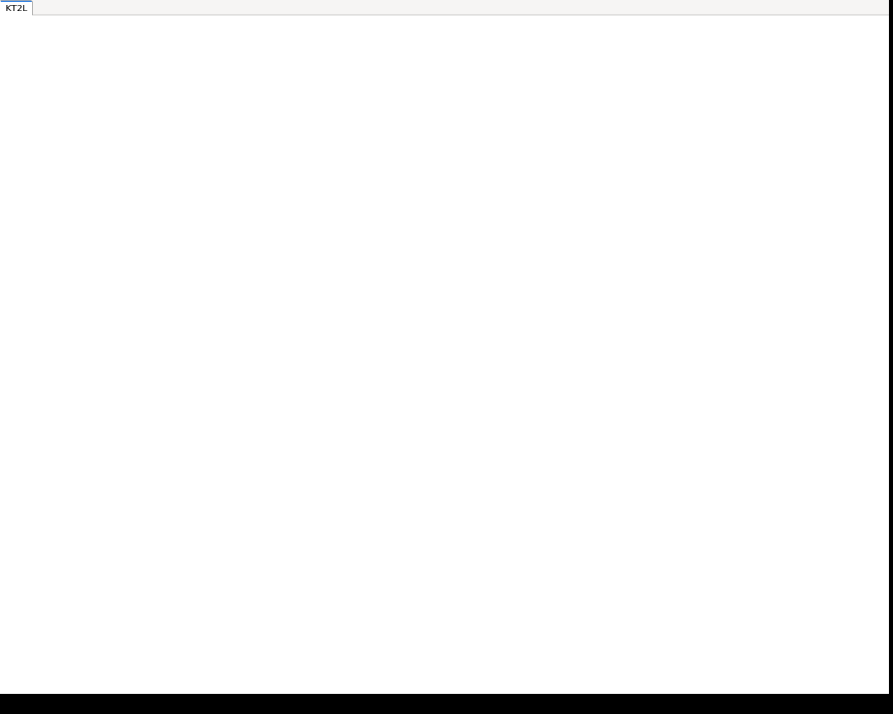

# Screenshots

## Cluster Select View

The cluster select view is the first view that is displayed when the application is started. 
The view shows a list of clusters that are available to the user. Cluster information is retrieved 
from the backend and can be configured in a cluster configuration file.

The user can select a cluster by clicking on the cluster name and open a view with the cluster details.

## Cluster Resources View

The cluster resources view shows lists of resources of a cluster. You can select a resource type,
namespace, and filters to display the resources.

A list ov available resource actions is displayed in the menu bar and context menu.

## Pod xterm View

The pod xterm view allows you to open a terminal session to a pod.

## Resources YAML Editor View

The resources YAML editor view allows you to edit the YAML of a resource.

## As Desktop Application

The application can be run as a desktop application. The application is started in a window and can be used as a desktop application.

