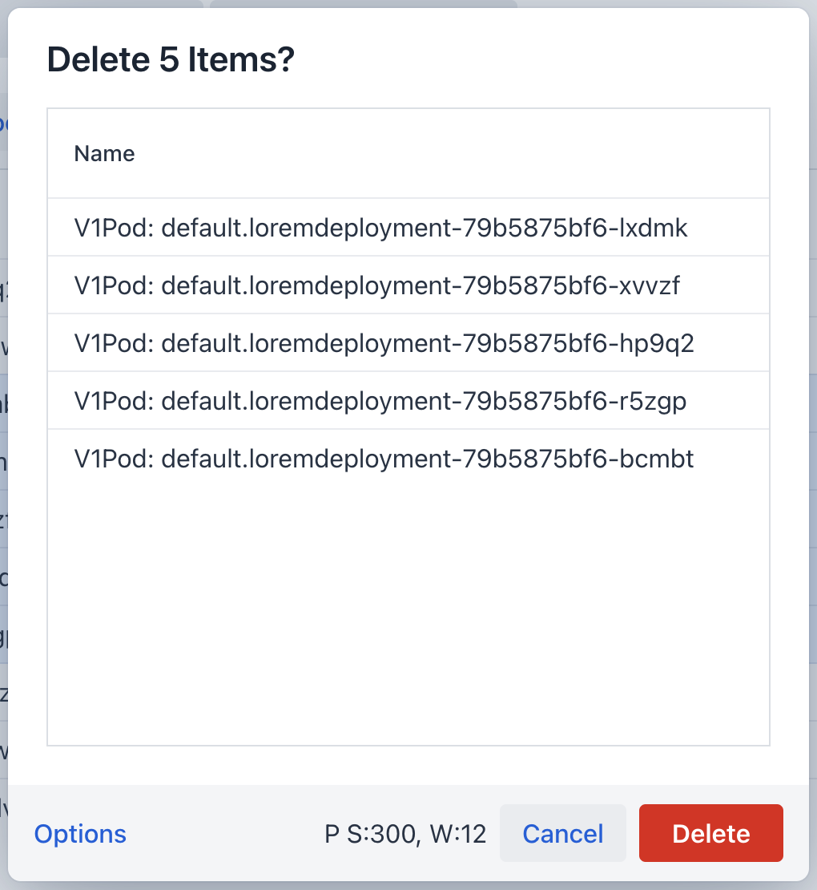
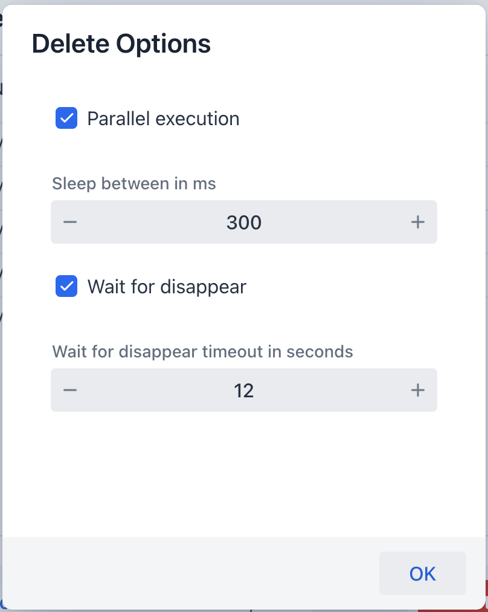

## Delete Resources

You can delete resources by selecting them and pressing the `Ctrl+Delete` key.
You will be asked for confirmation. In this dialog you can choose options for the deletion
of multiple resources.

### Options

`parallel` will delete all resources in parallel. This is faster but
can cause problems if you delete a lot of resources at once.

`sleep` will delete resources one by one with a sleep between each deletion. This is slower but
more gentle to the cluster.

`wait for disappear` will wait for the resource to disappear from the cluster before going on with the next deletion.

`disappear timeout` is the timeout in seconds to wait for the resource to disappear.

Options will be reseted each time you open the dialog. The default options can be configured in the `views`
configuration.

## Options Info

In the footer the current options are displayed. `P S:300 W:12` means that the deletion will
be done in parallel with a sleep of 300ms between each deletion and wait for disappear with
a timeout of 12 seconds. If the display is empty no special options are set.
